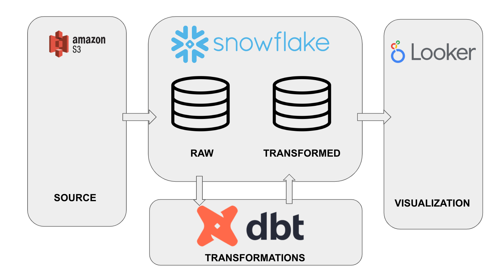

# Airbnb dbt project
This project was create to demonstrate my skills with SQL, dbt and data analysis.

## Architecture


## Snowflake
Snowflake is a fully managed SaaS (software as a service) that provides a single platform for data warehousing, data lakes, data engineering, data science, data application development, and secure sharing and consumption of real-time / shared data.

## DBT
Data Build Tool (dbt) is a transformation workflow that moduralize and centralize the analytics code. Basically, allows make the transformations throught the sql language with the best pratices of software engineering, like tests, documentation, versioning models etc.

## Makefile
File with commands used in everyday life.

## Sql
Structured query language (SQL) is a programming language for storing and processing information in a relational database.

## Local Setup
Execute the script below, it will create a virtualenv and install the necessary dependencies.<br>
Note: you should have python 3, pip and virtualenv previously installed.<br>
If you don't have, do the installation:<br>
`sudo apt-get install python3.8-dev python3.8-venv`
If you prefer, you can download it directly from the official website:<br>
https://www.python.org/downloads/release/python-3914/
<br>

### Snowflake user creation
Copy these SQL statements into a Snowflake Worksheet, select all and execute them (i.e. pressing the play button).

```sql
-- Use an admin role
USE ROLE ACCOUNTADMIN;

-- Create the `transform` role
CREATE ROLE IF NOT EXISTS transform;
GRANT ROLE TRANSFORM TO ROLE ACCOUNTADMIN;

-- Create the default warehouse if necessary
CREATE WAREHOUSE IF NOT EXISTS COMPUTE_WH;
GRANT OPERATE ON WAREHOUSE COMPUTE_WH TO ROLE TRANSFORM;

-- Create the `dbt` user and assign to role
CREATE USER IF NOT EXISTS dbt
  PASSWORD='<your_password>'
  LOGIN_NAME='<your_login_name>'
  MUST_CHANGE_PASSWORD=FALSE
  DEFAULT_WAREHOUSE='COMPUTE_WH'
  DEFAULT_ROLE='transform'
  DEFAULT_NAMESPACE='AIRBNB.RAW'
  COMMENT='DBT user used for data transformation';
GRANT ROLE transform to USER dbt;

-- Create our database and schemas
CREATE DATABASE IF NOT EXISTS AIRBNB;
CREATE SCHEMA IF NOT EXISTS AIRBNB.RAW;

-- Set up permissions to role `transform`
GRANT ALL ON WAREHOUSE COMPUTE_WH TO ROLE transform; 
GRANT ALL ON DATABASE AIRBNB to ROLE transform;
GRANT ALL ON ALL SCHEMAS IN DATABASE AIRBNB to ROLE transform;
GRANT ALL ON FUTURE SCHEMAS IN DATABASE AIRBNB to ROLE transform;
GRANT ALL ON ALL TABLES IN SCHEMA AIRBNB.RAW to ROLE transform;
GRANT ALL ON FUTURE TABLES IN SCHEMA AIRBNB.RAW to ROLE transform;

```

## Snowflake data import

Copy these SQL statements into a Snowflake Worksheet, select all and execute them (i.e. pressing the play button).

```sql
-- Set up the defaults
USE WAREHOUSE COMPUTE_WH;
USE DATABASE airbnb;
USE SCHEMA RAW;

-- Create our three tables and import the data from S3
CREATE OR REPLACE TABLE raw_listings
                    (id integer,
                     listing_url string,
                     name string,
                     room_type string,
                     minimum_nights integer,
                     host_id integer,
                     price string,
                     created_at datetime,
                     updated_at datetime);
                    
COPY INTO raw_listings (id,
                        listing_url,
                        name,
                        room_type,
                        minimum_nights,
                        host_id,
                        price,
                        created_at,
                        updated_at)
                   from 's3://dbtlearn/listings.csv'
                    FILE_FORMAT = (type = 'CSV' skip_header = 1
                    FIELD_OPTIONALLY_ENCLOSED_BY = '"');
                    

CREATE OR REPLACE TABLE raw_reviews
                    (listing_id integer,
                     date datetime,
                     reviewer_name string,
                     comments string,
                     sentiment string);
                    
COPY INTO raw_reviews (listing_id, date, reviewer_name, comments, sentiment)
                   from 's3://dbtlearn/reviews.csv'
                    FILE_FORMAT = (type = 'CSV' skip_header = 1
                    FIELD_OPTIONALLY_ENCLOSED_BY = '"');
                    

CREATE OR REPLACE TABLE raw_hosts
                    (id integer,
                     name string,
                     is_superhost string,
                     created_at datetime,
                     updated_at datetime);
                    
COPY INTO raw_hosts (id, name, is_superhost, created_at, updated_at)
                   from 's3://dbtlearn/hosts.csv'
                    FILE_FORMAT = (type = 'CSV' skip_header = 1
                    FIELD_OPTIONALLY_ENCLOSED_BY = '"');

```

After install python and virtual envinronment, follow the steps:<br>

* 1. Create and activate virtual env<br>
`make venv`
`source src/venv/bin/activate`

* 2. Install the necessary packages and libraries<br>
`make install`
`make install_packages`

* 3. To see the project documentation, run the following command<br>
`make show_documentation`

* 4. If you change the project, you can tun the following commando to refresh the documentation<br>
`make create_documentation`

* 5. To run the tests<br>
`make test`

* 6. To apply the freshness polices<br>
`make freshness`
